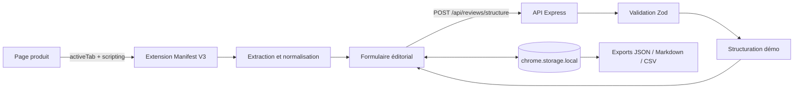

# ReviewFlow

> Une extension Chrome et Microsoft Edge pour transformer une page produit en fiche de recherche éditoriale structurée et exportable.

ReviewFlow permet de capturer les informations utiles d'une page produit, de les corriger, d'ajouter une analyse éditoriale, puis de générer et d'exporter une fiche exploitable. Le MVP `0.1.0` est terminé et a été validé manuellement dans Chrome et Microsoft Edge.

Ce projet de portfolio est indépendant. Il n'est ni commandé, ni approuvé, ni affilié à Whale Media.

## Pourquoi ReviewFlow ?

Une recherche produit oblige souvent à recopier les mêmes informations entre le navigateur, des notes et un document final. ReviewFlow rassemble ce parcours dans une seule interface :

- capture des métadonnées et du texte sélectionné depuis l'onglet actif ;
- extraction prioritaire des données structurées Schema.org `Product` ;
- correction et enrichissement manuel de tous les champs utiles ;
- sauvegarde locale des brouillons et reprise d'une fiche récente ;
- structuration déterministe par une API locale ;
- export en JSON, Markdown ou CSV.

## Architecture



L'extension ne transmet une fiche à l'API que lorsque l'utilisateur demande sa structuration. Les brouillons restent dans le stockage local du navigateur et aucune base de données ni aucun compte utilisateur n'est utilisé.

## Stack technique

| Partie              | Technologies                                           |
| ------------------- | ------------------------------------------------------ |
| Extension           | TypeScript, HTML, CSS, Chrome Extensions Manifest V3   |
| API                 | Node.js, Express 5, Zod                                |
| Qualité             | Vitest, Supertest, ESLint, Prettier, TypeScript strict |
| Navigateurs validés | Google Chrome et Microsoft Edge                        |

## Démarche de vibe coding responsable

ReviewFlow a été construit dans une démarche de développement assisté par IA, où l'IA sert de partenaire technique et non de substitut à la validation humaine.

- le besoin, le périmètre et les critères d'acceptation sont formalisés dans le cahier des charges et le backlog ;
- chaque fonctionnalité est découpée en étapes vérifiables ;
- le code produit est relu, commenté lorsque l'intention n'est pas évidente, puis testé ;
- la qualité est contrôlée par TypeScript strict, ESLint, Prettier, Vitest, Playwright et une validation manuelle dans Chrome et Edge ;
- les limites du produit, notamment l'absence actuelle de fournisseur LLM réel, sont documentées explicitement.

Cette approche montre comment accélérer le développement avec l'IA tout en conservant la compréhension, la responsabilité et la maîtrise technique du projet.

## Structure du dépôt

```text
reviewflow/
|-- extension/
|   |-- public/popup/        # Interface statique de l'extension
|   |-- src/
|   |   |-- api/             # Client de l'API ReviewFlow
|   |   |-- export/          # Sérialisation JSON et Markdown
|   |   |-- extraction/      # Lecture et normalisation de la page active
|   |   |-- popup/           # Orchestration de l'interface
|   |   |-- shared/          # Formulaire et modèle de brouillon
|   |   `-- storage/         # Persistance dans chrome.storage.local
|   `-- tests/
|-- api/
|   |-- src/                 # Routes, validation et mode démo
|   `-- tests/
|-- demo/                    # Page produit fictive reproductible
|-- docs/                    # Spécifications, backlog et stabilisation
`-- scripts/                 # Serveur statique de démonstration
```

## Installation locale

### Prérequis

- Node.js 20 ou supérieur ;
- npm 10 ou supérieur ;
- Chrome ou Microsoft Edge.

Depuis un terminal CMD ouvert à la racine du dépôt :

```cmd
npm install
npm run build
```

### Charger l'extension

1. Ouvrir `chrome://extensions` dans Chrome ou `edge://extensions` dans Edge.
2. Activer le **Mode développeur**.
3. Cliquer sur **Charger l'extension non empaquetée**.
4. Sélectionner le dossier `extension\dist`.
5. Épingler ReviewFlow à la barre d'outils si nécessaire.

Après une modification du code, exécuter de nouveau `npm run build`, puis recharger l'extension depuis la page des extensions.

### Démarrer l'API

```cmd
npm run start --workspace api
```

L'API écoute sur `http://localhost:3000`. Son état peut être vérifié dans un second terminal :

```cmd
curl http://localhost:3000/api/health
```

Réponse attendue :

```json
{ "status": "ok" }
```

### Démarrer la page de démonstration

```cmd
npm run demo
```

Ouvrir ensuite `http://localhost:4173`. Cette page fictive contient un produit, un prix, une devise, une description, des données JSON-LD et un passage sélectionnable afin de tester tout le parcours sans dépendre d'un site tiers.

### Exécuter l'API avec Docker

Docker Desktop doit être démarré. Si l'API Node.js locale utilise déjà le port `3000`, l'arrêter d'abord avec `Ctrl+C`.

```cmd
docker compose up --build
```

L'image multi-stage compile l'API, n'embarque que les dépendances de production et exécute Node.js avec un utilisateur non privilégié. Un healthcheck interroge automatiquement `/api/health`.

Pour arrêter et retirer le conteneur :

```cmd
docker compose down
```

La même image peut être construite et lancée sans Compose :

```cmd
docker build --file api\Dockerfile --tag reviewflow-api .
docker run --rm --publish 3000:3000 reviewflow-api
```

## Parcours utilisateur

1. Ouvrir une page produit et sélectionner éventuellement un passage intéressant.
2. Ouvrir ReviewFlow et cliquer sur **Capturer cette page**.
3. Vérifier ou corriger le nom, la description, la catégorie, le prix et la devise.
4. Ajouter les notes, points positifs, points négatifs, critères de test et tags.
5. Sauvegarder la fiche pour la conserver localement.
6. Cliquer sur **Structurer la fiche** lorsque l'API est démarrée.
7. Exporter le résultat en JSON, Markdown ou CSV.

Si l'API est indisponible, le brouillon local reste conservé et l'interface affiche un message explicite. Les fiches sauvegardées peuvent être rouvertes ou supprimées avec confirmation.

## Extraction et valeurs de repli

ReviewFlow utilise les sources disponibles selon leur précision :

1. données JSON-LD Schema.org de type `Product` et sa première offre ;
2. métadonnées standards et Open Graph ;
3. titre de la page ;
4. correction manuelle dans le formulaire.

Le prix accepte notamment les formats `149,90`, `1 299,90` et `1,299.90`, puis il est normalisé en nombre. La devise doit utiliser un code de trois lettres comme `EUR`. Aucune information absente n'est inventée.

## Modes de structuration

### Mode démo — disponible

Le mode actuellement connecté est volontairement déterministe. Il reformule uniquement les champs fournis, déduplique les critères de test et renvoie :

- un résumé ;
- une checklist ;
- le mode `demo` ;
- la date de génération.

Il ne demande aucune clé externe, fonctionne hors service tiers et rend la démonstration reproductible.

### Mode IA — prévu en bonus

Le modèle de données anticipe un futur mode `ai`, mais aucun fournisseur LLM réel n'est connecté dans le MVP. Cette évolution devra conserver la validation des entrées, la transparence sur les données envoyées et l'interdiction d'inventer des caractéristiques produit.

## API locale

| Méthode | Route                    | Rôle                                 |
| ------- | ------------------------ | ------------------------------------ |
| `GET`   | `/api/health`            | Vérifier la disponibilité du serveur |
| `POST`  | `/api/reviews/structure` | Valider puis structurer une fiche    |

Les requêtes JSON sont limitées à `100 ko`. Zod valide les données reçues et l'API renvoie des erreurs JSON stables sans exposer de détails internes. CORS autorise les origines d'extensions Chromium — Chrome et Edge utilisent toutes deux `chrome-extension://` — ainsi que les origines locales utiles au développement.

## Stockage, confidentialité et permissions

ReviewFlow conserve au maximum les 50 fiches les plus récemment modifiées dans `chrome.storage.local`. Le MVP n'utilise ni compte, ni cookie applicatif, ni télémétrie, ni base de données distante.

| Permission                | Utilisation                                                         |
| ------------------------- | ------------------------------------------------------------------- |
| `activeTab`               | Accéder uniquement à l'onglet explicitement ciblé par l'utilisateur |
| `scripting`               | Exécuter l'extracteur lors de la capture                            |
| `storage`                 | Sauvegarder les brouillons dans le navigateur                       |
| `http://localhost:3000/*` | Appeler uniquement l'API locale du MVP                              |

Les exports sont générés dans le navigateur à partir d'un `Blob`, sans permission de téléchargement supplémentaire. L'export CSV est encodé en UTF-8 avec BOM, utilise le séparateur `;` et protège les cellules contenant des retours à la ligne, guillemets ou séparateurs ; il s'ouvre ainsi proprement dans les tableurs francophones.

## Tests et qualité

```cmd
npm run format:check
npm run lint
npm test
npm run test:e2e
npm run build
```

La suite contient 29 tests unitaires et d'intégration : 21 pour l'extension et 8 pour l'API. Elle couvre notamment l'extraction, la validation du formulaire, le stockage, les exports, le client API, CORS, la validation serveur et la structuration démo.

Le parcours principal est également couvert par Playwright dans un véritable navigateur Chromium. Il traverse la page produit, le popup compilé et l'API réelle, puis vérifie capture, erreur de formulaire, persistance, structuration, exports et suppression. Les API propres à l'hôte d'extension sont remplacées par un adaptateur en mémoire ; l'installation réelle reste validée manuellement dans Chrome et Edge.

À chaque `push` et `pull request`, GitHub Actions exécute les contrôles de formatage, lint, tests unitaires, build, typecheck E2E et parcours Playwright.

Avant le premier lancement Playwright :

```cmd
npx playwright install chromium
```

Pour observer le scénario dans une fenêtre :

```cmd
npm run test:e2e:headed
```

## Limites du MVP

- l'API doit être lancée localement pour structurer une fiche ;
- le mode IA réel n'est pas encore connecté ;
- l'extraction dépend des métadonnées publiées par chaque site ;
- il n'existe pas encore de synchronisation entre navigateurs ou appareils ;
- les API Chrome du parcours automatisé utilisent un adaptateur ; le chargement de l'extension non empaquetée reste testé manuellement ;
- aucun déploiement public n'est encore fourni.

## Prochaines évolutions

- [x] automatiser le parcours navigateur de bout en bout ;
- [x] dockeriser l'API ;
- [ ] déployer l'API ;
- [ ] connecter un fournisseur LLM avec un mode dégradé sûr ;
- [x] ajouter l'export CSV ;
- [ ] enrichir l'accessibilité et la démonstration visuelle ;
- [ ] étudier une interface Angular sans alourdir le parcours de l'extension.

## Documentation du projet

- [Cahier des charges](docs/CAHIER_DES_CHARGES.md)
- [Backlog](docs/BACKLOG.md)
- [Rapport de stabilisation](docs/STABILISATION.md)
- [Guide de la page de démonstration](demo/README.md)
- [Licence MIT](LICENSE)

## Assistance IA pendant le développement

Une assistance IA a été utilisée comme partenaire de développement pour proposer des implémentations, des tests et de la documentation. Chaque changement a été relu, exécuté et validé humainement. Le produit livré n'utilise actuellement aucun modèle d'IA à l'exécution : seule la structuration déterministe du mode démo est active.

## État du projet

**MVP `0.1.0` terminé.** Les fonctionnalités RF-001 à RF-012 sont implémentées et le parcours principal est validé dans Chrome et Microsoft Edge. Les bonus seront traités séparément afin de préserver un socle démontrable et stable.
